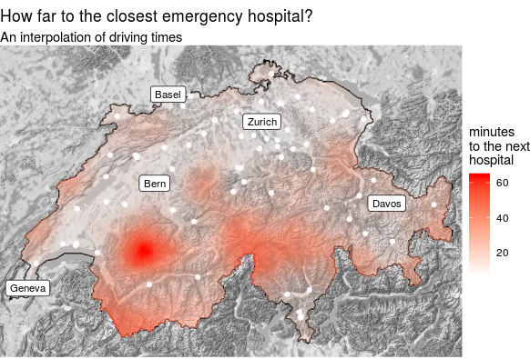

# Map related things

## Trackanimation video

The goal is to create a map animation. We use two methods: 

* We create an animation with **trackanimation** (https://pypi.org/project/trackanimation/). 
* We generate individual static map images with R and use OpenCV to create a video from it.

See the README in the relevant folder for more info.

## Driving times map

Creating a map of interpolated driving times using OSRM.

Can be found here: http://rpubs.com/mgei/drivingtimes

## Perspective raster map overlay

Coming soon.
